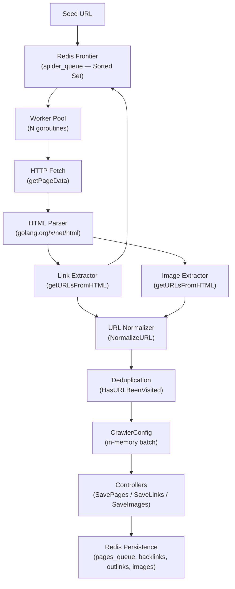

# Architecture

This document describes the system components of the Go Search Engine Spider, their responsibilities, and how data flows through the crawling pipeline.

---

## High-Level Architecture



---

## Component Breakdown

### 1. Entrypoint (`cmd/main.go`)

The main function orchestrates the entire crawl lifecycle:

1. Parses CLI flags (`--max-concurrency`, `--max-pages`)
2. Reads environment variables for Redis connection and seed URL
3. Connects to Redis via the `Database` struct
4. Pushes the seed URL into the frontier
5. Instantiates three controllers: `PageController`, `LinksController`, `ImageController`
6. Creates a `CrawlerConfig` with shared maps protected by a mutex
7. Enters an **infinite loop** (the batch cycle):
   - Checks the indexer queue size for backpressure
   - If the queue exceeds `MaxIndexerQueueSize` (5000), blocks on `signal_queue` for a `RESUME_CRAWL` signal
   - Spawns `MaxConcurrency` goroutines, each running `Crawl()`
   - Waits for all workers to finish (`WaitGroup.Wait()`)
   - Flushes accumulated data to Redis via controllers
   - Resets in-memory maps for the next batch

### 2. Crawler (`internal/crawler/`)

#### `CrawlerConfig` (`crawler.go`)

The central shared state for a crawl batch:

```go
type CrawlerConfig struct {
    Mu             *sync.Mutex
    Wg             *sync.WaitGroup
    Pages          map[string]*pages.Page
    Outlinks       map[string]*pages.PageNode
    Backlinks      map[string]*pages.PageNode
    Images         map[string][]*pages.Image
    MaxPages       int
    MaxConcurrency int
}
```

All map access is guarded by `Mu`. Key methods:

| Method             | Description                                                       |
|--------------------|-------------------------------------------------------------------|
| `maxPagesReached()`| Thread-safe check if batch page limit is hit                      |
| `addPage()`        | Adds a page if not already visited and under limit                |
| `AddImages()`      | Stores extracted images keyed by page URL                         |
| `UpdateLinks()`    | Builds outlink and backlink graph structures for the batch        |

#### `Crawl()` (`crawl.go`)

Each worker goroutine runs this BFS loop:

1. **Check batch limit** — If `MaxPages` is reached, return
2. **Pop URL** — Blocking pop from the Redis sorted set (`BZPopMin`)
3. **Dedup check** — Query Redis hash for visited status
4. **Fetch page** — Call `getPageData()` for HTML, status code, content type
5. **Extract links/images** — Call `getURLsFromHTML()`
6. **Store in-memory** — Add images, update link graph, add page
7. **Mark visited** — Write visited flag to Redis
8. **Enqueue discovered URLs** — Validate, score (depth + 1), and push to frontier

#### `getPageData()` (`get_page_data.go`)

HTTP fetching with production-grade configuration:

- **Timeout**: 30s total, 10s TLS handshake, 10s response header
- **Connection pooling**: 100 max idle, 10 per host
- **Body limit**: 10 MB via `io.LimitReader`
- **Content filtering**: Only `text/html` responses are accepted
- **Error handling**: HTTP 4xx/5xx are treated as errors
- **User-Agent**: `SearchEngineSpider/1.0`

#### `getURLsFromHTML()` (`get_urls_html.go`)

DOM traversal using `golang.org/x/net/html`:

- Parses the full HTML document into a node tree
- Recursively traverses all nodes
- Extracts `<a href>` values into a deduplicated set
- Extracts `` and `` into a map keyed by normalized source URL
- Resolves relative URLs against the page base URL
- Skips malformed URLs (containing spaces, `<`, `>`, `"`)
- Skips URLs with non-ASCII characters

### 3. Controllers (`internal/controllers/`)

Controllers are responsible for flushing in-memory batch data to Redis using **pipelined writes** for performance.

#### `PageController`

- Iterates over `CrawlerConfig.Pages`
- Converts each `Page` to a Redis hash via `HashPage()`
- Writes to `page_data:<normalized_url>` (hash)
- Pushes the key to `pages_queue` (list) for downstream indexing

#### `LinksController`

- Iterates over `CrawlerConfig.Backlinks` and `CrawlerConfig.Outlinks`
- Writes each link to `backlinks:<url>` or `outlinks:<url>` (sets)
- Uses `SADD` to naturally handle deduplication

#### `ImageController`

- Iterates over `CrawlerConfig.Images`
- Writes each image to `image_data:<source_url>` (hash with `page_url` and `alt`)
- Sets a 1-hour TTL on image entries
- Creates `page_images:<page_url>` sets mapping pages to their images

### 4. Database (`internal/database/`)

The `Database` struct wraps `go-redis/v9` and provides the following operations:

| Method                | Redis Command   | Key                   | Description                              |
|-----------------------|-----------------|-----------------------|------------------------------------------|
| `ConnectToRedis()`    | `PING`          | —                     | Establishes Redis connection             |
| `PushURL()`           | `ZADD`          | `spider_queue`        | Adds URL to frontier with priority score |
| `PopURL()`            | `BZPopMin`      | `spider_queue`        | Blocking pop of lowest-score URL         |
| `ExistsInQueue()`     | `ZSCORE`        | `spider_queue`        | Checks if URL exists and gets its score  |
| `HasURLBeenVisited()` | `HGET`          | `normalized_url:*`    | Checks visited flag                      |
| `VisitPage()`         | `HSET`          | `normalized_url:*`    | Marks URL as visited                     |
| `GetIndexerQueueSize()` | `LLEN`       | `pages_queue`         | Returns indexer queue length             |
| `PopSignalQueue()`    | `BRPOP`         | `signal_queue`        | Blocking pop for control signals         |

### 5. Pages / Models (`internal/pages/`)

#### `Page`

Represents a crawled webpage:

```go
type Page struct {
    NormalizedURL string
    HTML          string
    ContentType   string
    StatusCode    int
    LastCrawled   time.Time
}
```

`HashPage()` serializes it into a `map[string]interface{}` for Redis `HSET`.

#### `PageNode`

Represents a node in the link graph:

```go
type PageNode struct {
    NormalizedURL      string
    NormalizedLinkURLs map[string]struct{}  // set of linked URLs
}
```

Used for both outlink and backlink tracking. The `map[string]struct{}` pattern serves as a memory-efficient set.

#### `Image`

Represents an extracted image:

```go
type Image struct {
    NormalizedPageURL   string
    NormalizedSourceURL string
    Alt                 string
}
```

### 6. Utils (`internal/utils/`)

| Function         | File                | Description                                          |
|------------------|---------------------|------------------------------------------------------|
| `NormalizeURL()` | `normalize_url.go`  | Canonical URL normalization (see Crawling Strategy)   |
| `StripURL()`     | `strip_url.go`      | Removes URL fragments while preserving query params   |
| `IsValidURL()`   | `is_valid_url.go`   | Validates URL characters and filters unwanted URLs    |
| Constants        | `constants.go`      | Redis keys, queue names, timeouts, score bounds       |

---

## Data Flow Summary

```
┌─────────────┐     ZADD      ┌─────────────────┐    BZPopMin    ┌──────────────┐
│  Seed URL   │──────────────→│  spider_queue    │──────────────→│   Worker N   │
└─────────────┘               │  (Sorted Set)    │               └──────┬───────┘
                              └─────────────────┘                       │
                                     ↑                                  │ HTTP GET
                              ZADD   │                                  ↓
                              (new URLs)                         ┌──────────────┐
                                     │                           │  HTML Parse  │
                                     │                           └──────┬───────┘
                                     │                                  │
                                     │                     ┌────────────┴────────────┐
                                     │                     ↓                         ↓
                                     │              ┌─────────────┐          ┌──────────────┐
                                     └──────────────│  Links      │          │   Images     │
                                                    └─────────────┘          └──────────────┘
                                                           │                         │
                                                           ↓                         ↓
                                                    ┌─────────────────────────────────────┐
                                                    │   CrawlerConfig (in-memory batch)   │
                                                    └──────────────────┬──────────────────┘
                                                                       │
                                                            WaitGroup.Wait()
                                                                       │
                                                    ┌──────────────────┴──────────────────┐
                                                    │          Controllers                │
                                                    │  SavePages / SaveLinks / SaveImages  │
                                                    └──────────────────┬──────────────────┘
                                                                       │ Pipeline.Exec()
                                                                       ↓
                                                    ┌─────────────────────────────────────┐
                                                    │             Redis                   │
                                                    │  page_data:*  pages_queue            │
                                                    │  backlinks:*  outlinks:*             │
                                                    │  image_data:* page_images:*          │
                                                    └─────────────────────────────────────┘
```
