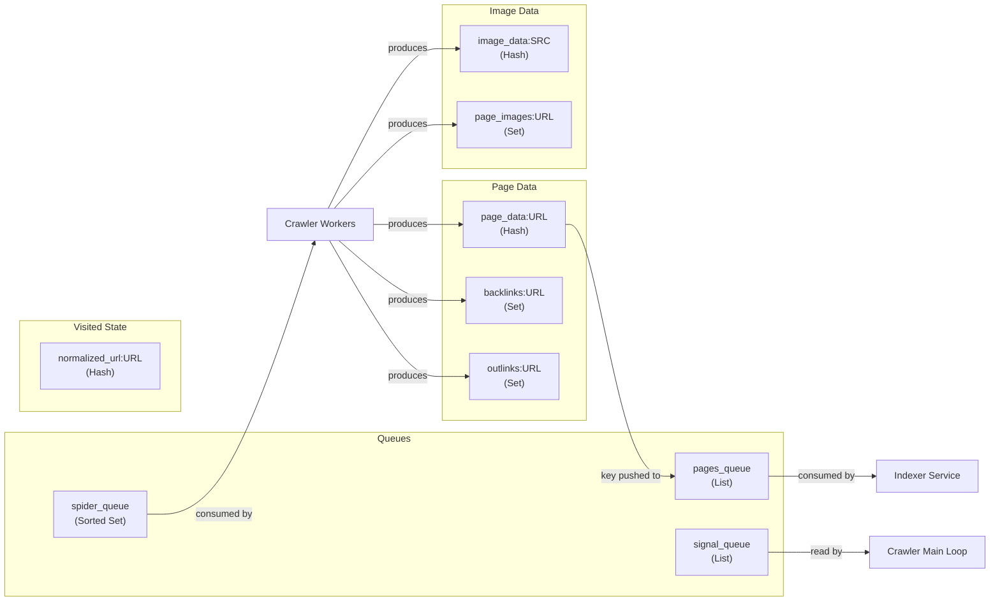

# Redis Data Model

This document describes every Redis key used by the crawl spider, its data type, the operations performed on it, and why each structure was chosen.

---

## Key Overview



---

## Queue Keys

### `spider_queue`

| Property    | Value                                                     |
|-------------|-----------------------------------------------------------|
| **Type**    | Sorted Set                                                |
| **Write**   | `ZADD spider_queue <score> <normalized_url>`              |
| **Read**    | `BZPopMin spider_queue <timeout>`                         |
| **Check**   | `ZSCORE spider_queue <normalized_url>`                    |
| **Purpose** | URL frontier / priority queue for crawl workers           |

**Why Sorted Set?** The sorted set provides `O(log N)` insertion and `O(log N)` pop-min — ideal for a priority queue. Members are unique by definition, so the same URL cannot be enqueued twice. `BZPopMin` provides blocking semantics so workers don't busy-wait when the queue is empty. The score represents crawl depth, ensuring breadth-first traversal.

**Score range:** `[-1000, 10000]` — clamped via `math.Max` / `math.Min`.

---

### `pages_queue`

| Property    | Value                                                     |
|-------------|-----------------------------------------------------------|
| **Type**    | List                                                      |
| **Write**   | `LPUSH pages_queue <page_data_key>`                       |
| **Read**    | Consumed by downstream indexer service                    |
| **Check**   | `LLEN pages_queue` (for backpressure)                     |
| **Purpose** | Queue of page keys ready for indexing                     |

**Why List?** The indexer consumes pages in FIFO order (via `BRPOP` on the other end). A list provides `O(1)` push/pop and `O(1)` length queries for backpressure checks. Values are Redis key references (`page_data:<url>`), not full page data — this avoids duplicating data and keeps the queue lightweight.

**Backpressure threshold:** 5000 entries. When `LLEN pages_queue >= 5000`, the crawler blocks.

---

### `signal_queue`

| Property    | Value                                                     |
|-------------|-----------------------------------------------------------|
| **Type**    | List                                                      |
| **Read**    | `BRPOP signal_queue 0` (infinite blocking)                |
| **Write**   | External service pushes `RESUME_CRAWL`                    |
| **Purpose** | Inter-service communication for backpressure release      |

**Why List with BRPOP?** `BRPOP` provides a clean blocking primitive. The crawler blocks indefinitely until a signal arrives, consuming zero CPU while waiting. The list acts as a simple message channel between the indexer and crawler.

**Known signals:**

| Signal         | Meaning                                  |
|----------------|------------------------------------------|
| `RESUME_CRAWL` | Indexer queue has drained; resume work   |

---

## Visited State

### `normalized_url:<normalized_url>`

| Property    | Value                                                     |
|-------------|-----------------------------------------------------------|
| **Type**    | Hash                                                      |
| **Write**   | `HSET normalized_url:<url> visited 1`                     |
| **Read**    | `HGET normalized_url:<url> visited`                       |
| **Purpose** | Persistent deduplication — tracks which URLs have been crawled |
| **Lifetime**| **Indefinite** — never expires                            |

**Why Hash?** A hash allows storing additional metadata per URL in the future (e.g., `last_crawled`, `crawl_count`, `status_code`) without changing the key structure. Currently only the `visited` field is used, but the schema is extensible.

**Example:**
```
normalized_url:https://example.com/about
  visited: 1
```

---

## Page Data

### `page_data:<normalized_url>`

| Property    | Value                                                     |
|-------------|-----------------------------------------------------------|
| **Type**    | Hash                                                      |
| **Write**   | `HSET page_data:<url> normalized_url <url> html <html> content_type <type> status_code <code> last_crawled <time>` |
| **Purpose** | Stores the full crawled page data for indexer consumption  |
| **Lifetime**| Transferred to MongoDB by the indexer service             |

**Fields:**

| Field            | Type     | Description                                |
|------------------|----------|--------------------------------------------|
| `normalized_url` | string   | Canonical URL                              |
| `html`           | string   | Full HTML body (up to 10 MB)               |
| `content_type`   | string   | Always `text/html`                         |
| `status_code`    | int      | HTTP response status code                  |
| `last_crawled`   | string   | RFC 1123 formatted timestamp               |

---

### `backlinks:<normalized_url>`

| Property    | Value                                                     |
|-------------|-----------------------------------------------------------|
| **Type**    | Set                                                       |
| **Write**   | `SADD backlinks:<url> <source_url>`                       |
| **Purpose** | Stores all pages that link **to** this URL                |
| **Lifetime**| Transferred by the backlinks processor                    |

**Why Set?** Sets provide `O(1)` insertion and automatic deduplication. A page can be discovered from multiple sources across batches — `SADD` naturally handles this without requiring application-level checks.

---

### `outlinks:<normalized_url>`

| Property    | Value                                                     |
|-------------|-----------------------------------------------------------|
| **Type**    | Set                                                       |
| **Write**   | `SADD outlinks:<url> <target_url>`                        |
| **Purpose** | Stores all pages that this URL links **to**               |
| **Lifetime**| Transferred by the indexer                                |

---

## Image Data

### `image_data:<normalized_source_url>`

| Property    | Value                                                     |
|-------------|-----------------------------------------------------------|
| **Type**    | Hash                                                      |
| **Write**   | `HSET image_data:<src> page_url <url> alt <alt_text>`     |
| **TTL**     | 1 hour (`EXPIRE`)                                         |
| **Purpose** | Stores image metadata for each unique image URL           |
| **Lifetime**| Short-lived; transferred by the image indexer             |

**Fields:**

| Field      | Type   | Description                          |
|------------|--------|--------------------------------------|
| `page_url` | string | Page where the image was found       |
| `alt`      | string | Alt text of the image                |

**Why TTL?** Image data is transient — it's consumed by the image indexer and does not need to persist indefinitely. The 1-hour TTL acts as garbage collection for unprocessed entries.

---

### `page_images:<normalized_page_url>`

| Property    | Value                                                     |
|-------------|-----------------------------------------------------------|
| **Type**    | Set                                                       |
| **Write**   | `SADD page_images:<url> <image_source_url>`               |
| **Purpose** | Reverse index: maps a page to all images found on it      |
| **Lifetime**| Transferred by the image indexer                          |

---

## Key Naming Convention

All keys follow the pattern `<prefix>:<identifier>`:

| Prefix           | Identifier          | Description                |
|------------------|---------------------|----------------------------|
| `normalized_url` | normalized URL      | Visited state              |
| `page_data`      | normalized URL      | Crawled page content       |
| `backlinks`      | normalized URL      | Inbound link set           |
| `outlinks`       | normalized URL      | Outbound link set          |
| `image_data`     | normalized image URL| Image metadata             |
| `page_images`    | normalized page URL | Page → images mapping      |

Queue keys (`spider_queue`, `pages_queue`, `signal_queue`) are singleton keys without suffixes.

---

## Data Lifecycle

```
┌───────────┐                    ┌────────────────┐                  ┌───────────┐
│  Crawler  │ ──── writes ────→  │     Redis      │ ──── read by ──→ │  Indexer  │
│           │                    │                │                  │  Service  │
└───────────┘                    └────────────────┘                  └─────┬─────┘
                                                                          │
                                                                    Transfers to
                                                                          │
                                                                    ┌─────┴─────┐
                                                                    │  MongoDB  │
                                                                    └───────────┘
```

- **Indefinite keys:** `normalized_url:*` — used for deduplication, never deleted
- **Transient keys:** `page_data:*`, `backlinks:*`, `outlinks:*` — consumed and transferred by downstream services
- **TTL keys:** `image_data:*` — auto-expire after 1 hour if not consumed
